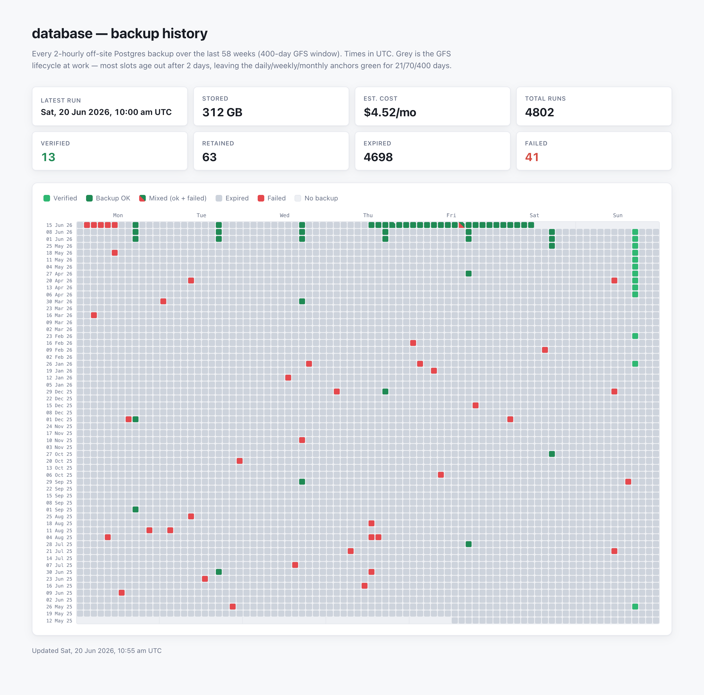

# the-gitfather

> Off-site, **G**randfather-**F**ather-**S**on retained, monitored, restore-verified Postgres backups —
> driven by GitHub Actions, stored on Cloudflare R2.

<p align="center">
  
</p>

<p align="center"><sub>The static <a href="#backup-history-dashboard">backup-history dashboard</a> — every 2-hourly backup over a 1-year window, with restore-verified drills, storage and estimated R2 cost.</sub></p>

A small, **profile-driven** tool any project can adopt: point it at a Postgres connection string and an
R2 bucket and you get the **off-site, immutable, restore-verified** pillars of the **3-2-1-1-0** backup
pattern (the *1-1-0*) — plus one independent off-site copy toward the *3-2* — with a daily Slack status
row and a static backup-history dashboard. The engine knows nothing about any one project; everything
project-specific lives in a `profiles/*.yaml` file kept in *your* repo, and credentials come from the
environment (GitHub secrets), never from the repo. See [Where this fits: 3-2-1-1-0](#where-this-fits-3-2-1-1-0).

> **Setting up?** The fastest path is to hand [`docs/setting-up-gitfather.md`](docs/setting-up-gitfather.md)
> to an AI coding agent — a guided walkthrough that interviews you for each value, writes the profile +
> secrets, and finishes with a green `doctor` check. Prefer to wire it by hand? See
> [Wiring a consuming repo](#wiring-a-consuming-repo) below.

```
the-gitfather/
  scripts/
    backup-pg-to-r2.ts    # dump → (encrypt) → upload 2hourly/ → promote to daily/weekly/monthly; records a SHA-256
    restore-drill-pg.ts   # pull newest → restore into a throwaway → assert row counts (exports drillObject)
    verify-durable-pg.ts  # DAILY: hash-check each durable object + restore freshest daily + re-restore aged weekly/monthly
    check-staleness.ts    # alert if no fresh backup landed recently; self-heal a missed tick
    build-dashboard.ts    # render the static backup-history dashboard from the R2 run-logs
    runlog.ts             # append-only run/verification log in R2 (the dashboard's source of truth)
    lib/                  # config, profile, duration, pgconn, slack, proc, logStore, pgRestore, preflight, bootEnv, schedule, backupTypes, backupHistory (all .ts)
    __tests__/            # unit + bash-parity tests (node:test via tsx)
  dashboard/              # single-file static dashboard (template + SVG heatmap renderer)
  profiles/example.yaml    # copy this into YOUR repo and edit
  .github/
    workflows/            # REUSABLE (on: workflow_call): pg-backup, pg-restore-drill,
                          #   pg-durable-verify, pg-staleness-check, pg-dashboard
    actions/setup-tools   # composite: pinned rclone (+ optional pg client)
```

Built as a GitHub-Actions toolkit (TypeScript run via `tsx`), but every script is runnable locally for testing.

---

## Where this fits: 3-2-1-1-0

**3-2-1-1-0** is the hardened evolution of the classic 3-2-1 backup rule:

| Digit | Rule | What it's for |
|---|---|---|
| **3** | ≥3 copies of the data | One primary + two backups, so no single loss is fatal |
| **2** | on ≥2 different media | Different *failure domains* — a flaw that kills one medium doesn't kill both |
| **1** | ≥1 copy off-site | Survives a site-level disaster (fire, theft, region outage) |
| **1** | ≥1 copy immutable / offline | Survives ransomware or a leaked/malicious credential that tries to delete backups |
| **0** | **0** recovery-verification errors | A backup you've never restored is a hope, not a backup — prove it restores |

The last two digits are what most setups skip, and they're exactly where this tool is strong. Here's
the honest mapping of what the-gitfather delivers:

| Digit | Coverage | How |
|---|---|---|
| **3** copies | ⚠️ partial | Manages **one** backup destination (a single R2 bucket). The GFS tiers are point-in-time *versions of the same dump in the same bucket* — more restore points, not independent copies. Your production DB is copy #1 (the source, not the tool's job); R2 is copy #2; a 3rd copy is on you. |
| **2** media | ❌ not provided | Every copy the tool writes lives on one medium / provider / failure domain (R2). "2 media" only exists incidentally because your prod DB lives elsewhere. |
| **1** off-site | ✅ delivered | Dumps go to Cloudflare R2 — a different provider and location from your Postgres host. |
| **1** immutable | ✅ delivered* | R2 bucket locks (WORM) + a no-delete CI token make the durable tiers immutable for 14 days against the primary threat (a leaked CI key). *It's immutable, not air-gapped — a full account takeover can strip the locks. See [Threat model](#threat-model). |
| **0** errors | ✅ delivered | Each backup carries a SHA-256 and is structurally validated (`pg_restore -l`) before it's declared good; `verify-durable-pg.ts` then proves **every** durable copy — hash-checked on write, full-restored daily (the freshest dump) and again at ~2 weeks (weekly/monthly) — with row-count gates, a `pg_restore`-error classifier, and failed drills recorded to the log. Backed by the staleness check (size + freshness), Slack status, and an external dead-man's switch. |

**Net:** the tool nails the back half (**1-1-0**) and supplies **one off-site copy** toward the front
half — it does not by itself give you 3 independent copies on 2 distinct media. To earn the full
**3-2-1-1-0**, add a second, independent backup leg on a different medium / failure domain (e.g. a
periodic `pg_dump` to local disk/NAS, or replicate the R2 bucket to another provider or region). The
dump this tool already produces is the natural feed for it.

---

## How it fits together

The reusable workflows live here; **each consuming repo keeps a thin caller workflow** that owns the
cron schedule + secrets and passes the path to its own profile. Because this repo is public, the
reusable workflows check out their own script code with no token. Because the profile lives in the
*caller* repo, each reusable workflow checks out two things: the caller repo (for the profile) and this
repo (for the scripts).

```
your-repo                              the-gitfather (this repo, public)
  pg-backup/myproject.yaml   ─────►     scripts/ + dashboard/
  .github/workflows/                   .github/workflows/  (reusable)
    pg-backup.yml ───────────uses────────►  pg-backup.yml
    pg-durable-verify.yml ───uses────────►  pg-durable-verify.yml   (daily; supersedes the weekly drill)
    pg-restore-drill.yml ────uses────────►  pg-restore-drill.yml    (optional once durable-verify is wired)
    pg-staleness-check.yml ──uses────────►  pg-staleness-check.yml
    pg-dashboard.yml ────────uses────────►  pg-dashboard.yml
```

> **Scheduling — GitHub cron *or* the Cloudflare scheduler.** The caller workflows below carry their own
> `schedule:` cron, which is the simplest setup. GitHub's cron is best-effort, though — it delays and
> occasionally drops ticks (the staleness watchdog exists to self-heal exactly that). If you run several
> backups and want a single, more punctual, **free** scheduler, [`scheduler/`](scheduler/) is a one-Worker
> Cloudflare alternative: it fires each caller's `workflow_dispatch` on a Cron Trigger and logs its state
> to the shared dashboard bucket. To use it, **delete the `schedule:` blocks** from your callers (keep
> `workflow_dispatch:`) and then deploy the Worker as the sole scheduler. See
> [`scheduler/README.md`](scheduler/README.md).

---

## Wiring a consuming repo

> 💡 Want this done for you? [`docs/setting-up-gitfather.md`](docs/setting-up-gitfather.md) is an
> LLM-guided walkthrough of every step below.

### 1. Add your profile

Copy [`profiles/example.yaml`](profiles/example.yaml) into your repo (e.g. `pg-backup/myproject.yaml`) and
edit it. It is **non-secret** — `name`, `backup-prefix`, dump flags, GFS anchor, `retention:` windows,
the restore-drill `row-count-table`, timezone, etc. See **Profile reference** below.

### 2. Add the caller workflows (`.github/workflows/` in your repo)

> **Secrets must be passed explicitly.** This repo is **public and owned by `simonhac`**, so for any
> consumer in a *different* account/org, GitHub's `secrets: inherit` shortcut **does not work** (it
> only passes secrets to reusable workflows in the *same* org/enterprise). The examples below therefore
> pass each secret explicitly and thread the non-secret deployment identifiers (R2 bucket, Slack channel) as
> inputs — this works from any owner. All project *config* lives in the committed `profiles/*.yaml`. If your repo is in the same org as this one, you may use `secrets: inherit`.

`pg-backup.yml`:

```yaml
name: My DB backup → R2          # keep this name — pg-dashboard's workflow_run references it
on:
  schedule:
    - cron: "0 */2 * * *"        # every 2 hours (UTC); the anchor-hour-utc run also promotes
  workflow_dispatch:
    inputs:
      reason:
        description: "Why this run fired; the self-heal passes 'self-heal' (drives the Slack-row marker)."
        type: string
        default: manual
concurrency: { group: pg-backup, cancel-in-progress: false }
jobs:
  backup:
    permissions: { contents: read, actions: read }   # optional — precise job-log link in failure alerts; see "Job-log link"
    uses: simonhac/the-gitfather/.github/workflows/pg-backup.yml@main
    with:
      profile: pg-backup/myproject.yaml
      r2_bucket: ${{ vars.R2_BUCKET }}
      slack_channel: ${{ vars.SLACK_CHANNEL }}
      trigger: ${{ github.event_name == 'schedule' && 'schedule' || github.event.inputs.reason }}
    secrets:
      PG_BACKUP_DATABASE_URL: ${{ secrets.PG_BACKUP_DATABASE_URL }}
      R2_ACCOUNT_ID: ${{ secrets.R2_ACCOUNT_ID }}
      R2_ACCESS_KEY_ID: ${{ secrets.R2_ACCESS_KEY_ID }}
      R2_SECRET_ACCESS_KEY: ${{ secrets.R2_SECRET_ACCESS_KEY }}
      SLACK_BOT_TOKEN: ${{ secrets.SLACK_BOT_TOKEN }}   # optional
      HEARTBEAT_URL: ${{ secrets.HEARTBEAT_URL }}       # optional
      ALERT_WEBHOOK_URL: ${{ secrets.ALERT_WEBHOOK_URL }}   # optional failure webhook (no-bot fallback / redundant channel)
```

`pg-restore-drill.yml`:

```yaml
name: My DB restore drill
on:
  schedule:
    - cron: "37 17 * * 1"        # Mondays 17:37 UTC
  workflow_dispatch: {}
concurrency: { group: pg-restore-drill, cancel-in-progress: false }
jobs:
  drill:
    permissions: { contents: read, actions: read }   # optional — precise job-log link in failure alerts; see "Job-log link"
    uses: simonhac/the-gitfather/.github/workflows/pg-restore-drill.yml@main
    with:
      profile: pg-backup/myproject.yaml
      r2_bucket: ${{ vars.R2_BUCKET }}
      slack_channel: ${{ vars.SLACK_CHANNEL }}
    secrets:
      PG_BACKUP_DATABASE_URL: ${{ secrets.PG_BACKUP_DATABASE_URL }}
      R2_ACCOUNT_ID: ${{ secrets.R2_ACCOUNT_ID }}
      R2_ACCESS_KEY_ID: ${{ secrets.R2_ACCESS_KEY_ID }}
      R2_SECRET_ACCESS_KEY: ${{ secrets.R2_SECRET_ACCESS_KEY }}
      SLACK_BOT_TOKEN: ${{ secrets.SLACK_BOT_TOKEN }}   # optional
      ALERT_WEBHOOK_URL: ${{ secrets.ALERT_WEBHOOK_URL }}   # optional failure webhook
```

`pg-durable-verify.yml` (runs **daily**) — guarantees *every* durable file is integrity-tested, not just
the newest. Its **primary** leg hash-checks each new daily/weekly/monthly object against the SHA-256 recorded
at backup time and full-restores the freshest `daily`; its **secondary** leg re-restores the newest
weekly/monthly object ≥ `verify-durable.retest-days` (14) old not yet restore-verified. Net: weekly/monthly
are validated twice (hash on write + restore at ~2 weeks), daily once. Because the daily primary restore covers
the freshest dump more often than the weekly drill, this **supersedes `pg-restore-drill.yml`** — wire this one
and drop the weekly drill (or keep both). Cadence/limits are profile knobs (`verify-durable.fresh`,
`verify-durable.aged`, `verify-durable.retest-days`, `verify-durable.max-restores`).

```yaml
name: My DB durable verify
on:
  schedule:
    - cron: "37 18 * * *"        # daily, after the anchor-hour backup
  workflow_dispatch: {}
concurrency: { group: pg-durable-verify, cancel-in-progress: false }
jobs:
  verify:
    permissions: { contents: read, actions: read }   # optional — precise job-log link in failure alerts; see "Job-log link"
    uses: simonhac/the-gitfather/.github/workflows/pg-durable-verify.yml@main
    with:
      profile: pg-backup/myproject.yaml
      r2_bucket: ${{ vars.R2_BUCKET }}
      slack_channel: ${{ vars.SLACK_CHANNEL }}
    secrets:
      PG_BACKUP_DATABASE_URL: ${{ secrets.PG_BACKUP_DATABASE_URL }}
      R2_ACCOUNT_ID: ${{ secrets.R2_ACCOUNT_ID }}
      R2_ACCESS_KEY_ID: ${{ secrets.R2_ACCESS_KEY_ID }}
      R2_SECRET_ACCESS_KEY: ${{ secrets.R2_SECRET_ACCESS_KEY }}
      SLACK_BOT_TOKEN: ${{ secrets.SLACK_BOT_TOKEN }}   # optional
      AGE_IDENTITY: ${{ secrets.AGE_IDENTITY }}   # only if backups are .age-encrypted
      ALERT_WEBHOOK_URL: ${{ secrets.ALERT_WEBHOOK_URL }}   # optional failure webhook
```

`pg-staleness-check.yml` — note the `permissions` block (the self-heal re-triggers your backup workflow):

```yaml
name: My DB staleness check
on:
  schedule:
    - cron: "*/10 * * * *"       # every 10 min — GitHub drops cron ticks in correlated clusters
                                 # (backup + watchdog together), so 6 chances/hour keeps the watchdog
                                 # live. It only ACTS when the current backup slot is overdue (grace-minutes).
  workflow_dispatch: {}
concurrency: { group: pg-staleness-check, cancel-in-progress: false }
jobs:
  check:
    permissions:
      actions: write             # lets the self-heal call `gh workflow run pg-backup.yml`
      contents: read
    uses: simonhac/the-gitfather/.github/workflows/pg-staleness-check.yml@main
    with:
      profile: pg-backup/myproject.yaml
      r2_bucket: ${{ vars.R2_BUCKET }}
      slack_channel: ${{ vars.SLACK_CHANNEL }}
    secrets:
      R2_ACCOUNT_ID: ${{ secrets.R2_ACCOUNT_ID }}
      R2_ACCESS_KEY_ID: ${{ secrets.R2_ACCESS_KEY_ID }}
      R2_SECRET_ACCESS_KEY: ${{ secrets.R2_SECRET_ACCESS_KEY }}
      SLACK_BOT_TOKEN: ${{ secrets.SLACK_BOT_TOKEN }}   # optional
      ALERT_WEBHOOK_URL: ${{ secrets.ALERT_WEBHOOK_URL }}   # optional failure webhook
```

`pg-dashboard.yml` — runs after each backup, isolated so a dashboard failure never affects backups:

```yaml
name: My DB backup dashboard → R2
on:
  workflow_run:
    workflows: ["My DB backup → R2"]   # must match the backup caller's `name:`
    types: [completed]
  workflow_dispatch: {}
concurrency: { group: pg-dashboard, cancel-in-progress: true }
jobs:
  publish:
    uses: simonhac/the-gitfather/.github/workflows/pg-dashboard.yml@main
    with:
      profile: pg-backup/myproject.yaml
      r2_bucket: ${{ vars.R2_BUCKET }}
      dashboard_r2_bucket: ${{ vars.DASHBOARD_R2_BUCKET }}
    secrets:
      R2_ACCOUNT_ID: ${{ secrets.R2_ACCOUNT_ID }}
      R2_ACCESS_KEY_ID: ${{ secrets.R2_ACCESS_KEY_ID }}
      R2_SECRET_ACCESS_KEY: ${{ secrets.R2_SECRET_ACCESS_KEY }}
      DASHBOARD_R2_ACCESS_KEY_ID: ${{ secrets.DASHBOARD_R2_ACCESS_KEY_ID }}
      DASHBOARD_R2_SECRET_ACCESS_KEY: ${{ secrets.DASHBOARD_R2_SECRET_ACCESS_KEY }}
```

> **Pinning.** `@main` always runs the latest. To pin a release, tag this repo (e.g. `v1`) and use
> `…@v1` **and** add `gitfather_ref: v1` to each `with:` so the scripts checkout matches the workflow.

### 3. Set the secrets / variables (in your repo)

The caller reads these and passes them in (explicit `secrets:` + `with:` inputs, as above).

| Kind | Name | Value |
|---|---|---|
| secret | `PG_BACKUP_DATABASE_URL` | `postgres://…:5432/…?sslmode=require` (master DB URL; **never** commit/log) |
| secret | `R2_ACCOUNT_ID` | Cloudflare account id |
| secret | `R2_ACCESS_KEY_ID` / `R2_SECRET_ACCESS_KEY` | scoped R2 S3 token (Object Read & Write, **no delete**) |
| **variable** | `R2_BUCKET` | private dump bucket name |
| secret | `SLACK_BOT_TOKEN` | (optional) `xoxb-…`, scope `chat:write` |
| **variable** | `SLACK_CHANNEL` | (optional) channel id `C…` — the non-secret id paired with the bot token |
| secret | `HEARTBEAT_URL` | (optional) dead-man's-switch ping URL |
| secret | `ALERT_WEBHOOK_URL` | (optional) generic **failure** webhook (Slack-compatible `{"text":…}` POST) — a no-bot alert fallback, or a redundant failure channel into a host app's existing incoming webhook when the bot is also set |
| secret | `AGE_RECIPIENT` / `AGE_IDENTITY` | (optional) only when `encryption: age` |
| **variable** | `DASHBOARD_R2_BUCKET` | (dashboard) public bucket name |
| secret | `DASHBOARD_R2_ACCESS_KEY_ID` / `DASHBOARD_R2_SECRET_ACCESS_KEY` | (dashboard) write-only token for the public bucket |

> Pushing workflow files needs a token with the `workflow` scope.

---

## Backup tiers (GFS + a finer "grandson" tier)

| Tier | Label | Cadence | R2 prefix | Lifecycle expiry (default) | Bucket lock |
|---|---|---|---|---|---|
| 2-hourly | grandson | every 2 h | `<prefix>/2hourly/` | 2 days | none |
| daily | Son | anchor hour | `<prefix>/daily/` | 3 weeks | 14 days |
| weekly | Father | Sundays @ anchor | `<prefix>/weekly/` | 13 weeks | 14 days |
| monthly | Grandfather | 1st @ anchor | `<prefix>/monthly/` | 2 years | 14 days |

The expiry windows are the **profile's `retention:` block** (natural-language durations — see *Profile
reference*); the values above are the defaults. At most ~82 backups are retained at once. **These windows
are also what the dashboard renders, but R2 itself does the deleting** via the lifecycle rules below —
keep the two in sync (changing the profile does not reconfigure R2).

**One dump, promoted to all qualifying tiers.** Each run dumps once and uploads to `2hourly/`. The run
whose UTC hour equals `anchor-hour-utc` is also **server-side copied** (R2→R2, no re-dump) into `daily/`,
plus `weekly/` on Sundays, plus `monthly/` on the 1st. Retention and immutability are enforced by **R2
lifecycle rules + bucket locks per prefix**, not by code.

### Create the R2 bucket, lifecycle rules, and bucket locks (once)

Run with **account-level** Cloudflare creds (this credential is the one that can weaken locks — **never**
give it to CI). Replace `<your-bucket>` and `<prefix>` (your profile's `backup-prefix`).

```bash
npx wrangler r2 bucket create <your-bucket>

# Lifecycle: expire each tier on its own schedule
# Match these --expire-days to the profile's retention: block (defaults: 2 days / 3 weeks / 13 weeks / 2 years).
npx wrangler r2 bucket lifecycle add <your-bucket> expire-2hourly <prefix>/2hourly/ --expire-days 2
npx wrangler r2 bucket lifecycle add <your-bucket> expire-daily   <prefix>/daily/   --expire-days 21
npx wrangler r2 bucket lifecycle add <your-bucket> expire-weekly  <prefix>/weekly/  --expire-days 91
npx wrangler r2 bucket lifecycle add <your-bucket> expire-monthly <prefix>/monthly/ --expire-days 730
npx wrangler r2 bucket lifecycle add <your-bucket> abort-mpu      <prefix>/         --abort-multipart-days 1
npx wrangler r2 bucket lifecycle add <your-bucket> expire-status  _status/          --expire-days 14
npx wrangler r2 bucket lifecycle add <your-bucket> expire-log     _log/             --expire-days 760

# Bucket locks (WORM): 14-day immutability on the DURABLE tiers only — NOT on 2hourly/ (a lock there
# would block its 2-day expiry, since locks take precedence over lifecycle).
npx wrangler r2 bucket lock add <your-bucket> lock-daily   <prefix>/daily/   --retention-days 14
npx wrangler r2 bucket lock add <your-bucket> lock-weekly  <prefix>/weekly/  --retention-days 14
npx wrangler r2 bucket lock add <your-bucket> lock-monthly <prefix>/monthly/ --retention-days 14
```

Then mint a **scoped R2 S3 API token** for CI: Object **Read & Write**, **no delete**, scoped to this
bucket. That token cannot delete locked objects, overwrite them (keys are unique), or change
lock/lifecycle config — it is the only R2 credential CI gets.

For the dashboard, create a **separate public** bucket and a **write-only** token for it (the dump
bucket gains no web surface).

---

## Verifying backups (integrity)

"A backup you've never restored is a hope, not a backup." Integrity is checked at three points, so
**every durable file is proven recoverable**, not just the newest one.

**1. At backup time** (`backup-pg-to-r2.ts`) — before a dump is declared good:

- **`dump.min-bytes`** floor — a suspiciously small dump is never uploaded.
- **`integrity.check-structure`** (default on) — `pg_restore -l` lists the archive's TOC; a corrupt or
  truncated dump above the size floor can't be listed and is rejected *before* it's reported as a success.
  (For `encryption: none`; age dumps are validated by the drill / by `integrity.verify-after-upload`.)
- **`integrity.checksum`** (default on) — a streaming SHA-256 of the exact uploaded bytes (ciphertext for
  age) is recorded in the run-log; it's the baseline the durable hash-check compares against.
- **`integrity.verify-after-upload`** (opt-in, off by default) — after upload, re-download the object,
  confirm its SHA-256 matches, and `pg_restore -l` it. This is the only *backup-time* structural check for
  age (it needs `AGE_IDENTITY` in the backup job to decrypt). Costs a re-download per run, so it's opt-in.

**2. The restore drill** (`restore-drill-pg.ts`) — restores the newest `2hourly` dump into a throwaway
Postgres and gates on the data, not just a clean exit:

- The `drill.row-count-table` count must be **`drill.min-row-ratio` ≤ restored/live ≤ `drill.max-row-ratio`**
  (catches truncation *and* duplication; live is `n_live_tup`, an estimate).
- **`drill.present-tables`** must each exist in the restore; **`drill.nonempty-tables`** must each exist
  *and* be non-empty (catches a partial-schema restore).
- `pg_restore` stderr is **classified**: known managed-schema noise (missing roles/extensions, ownership,
  idempotent "already exists") is tolerated; any *unrecognised* error fails the drill.
- **`drill.max-row-drop`** (optional, off by default) fails the drill if a table shrank more than the
  given fraction vs the previous passing drill.

**3. Daily durable verification** (`verify-durable-pg.ts`, the `pg-durable-verify.yml` workflow) —
guarantees **every** `daily`/`weekly`/`monthly` object is tested, driven by the verifications log so a
missed run self-corrects:

- **`verify-durable.fresh`** (default on): on first sight, hash-check each durable object against its
  recorded SHA-256 (proves the server-side copy is byte-intact), and full-restore the freshest `daily`.
- **`verify-durable.aged`** (default on): full-restore the newest `weekly`/`monthly` object **≥
  `verify-durable.retest-days` (14)** old not yet restore-verified (the aged-copy proof, just inside the WORM lock).
- **`verify-durable.max-restores`** caps full restores per run (hash-checks are uncapped — cheap).

Net: **weekly/monthly are validated twice** (hash on write + restore at ~2 weeks), **daily once** (it's
the short-lived 3-week tier). Because the daily primary restore covers the freshest dump every day, this
**supersedes the weekly `pg-restore-drill.yml`** — wire `pg-durable-verify.yml` and drop the weekly drill.

Every drill — pass **or fail** — is recorded to the verifications log, so a failed restore shows up: on
the dashboard as an **amber "Drill failed"** cell (distinct from a red *failed backup*), and as a loud
Slack/`ALERT_WEBHOOK_URL` page. The hash-vs-restore distinction drives the tooltip wording.

---

## Slack (optional)

Instead of one message per run (spam), the backup keeps **one message per day** and **updates it in
place** — a `✅`/`❌` + `HH:MM` tick per 2-hourly run, in the profile's `timezone`. A failed run appends `❌` and
posts a loud, `@here`-mentioning threaded alert whose `<basename> DB backup` title links to the dashboard
(`dashboard.url`) and whose error reason links to that run's GitHub Actions **job log** (falling back to the
run page, or plain text off-Actions). The staleness, restore-drill, and durable-verify failure pages share
this format. Any **elapsed-but-empty** 2-hourly bucket renders as
`⬜ HH:00`, so a skipped run shows as a visible gap; the staleness check (every ~10 min) re-renders the row so a
just-missed slot surfaces within minutes. This needs a **bot token** (`chat.update`; incoming webhooks
can't update). "Today's message" is persisted as a tiny JSON object at `_status/<basename>/<date>.json`
in R2. If `SLACK_BOT_TOKEN`/`SLACK_CHANNEL` are unset, all Slack output is silently skipped.

**Failure webhook (no-bot fallback).** Separately from the bot, set `ALERT_WEBHOOK_URL` to get a
Slack-compatible `{"text":…}` POST on **failure only** (backup / restore-drill / staleness) — the simple
alerting path when you don't run a bot, or a redundant failure channel into a host app's existing
incoming webhook when you do. It can't update in place, so it fires on failures only (no per-run success
spam). Unset → no-op.

Setup: create a Slack app → **Bot Token Scopes**: `chat:write` → install → copy the `xoxb-…` token →
**invite the bot to the channel** (`/invite @your-app`) → set `SLACK_BOT_TOKEN` + `SLACK_CHANNEL`.

> **Job-log link (optional).** The error-reason link resolves *this* run's per-job log page via the jobs
> REST API, which needs the run's `GITHUB_TOKEN` to have **`actions: read`**. The reusable workflows pass
> the token but **don't** request that scope themselves — a reusable workflow's `permissions:` is a *hard
> requirement* on every caller, so requesting a scope the caller doesn't grant fails the run at startup
> (`startup_failure`). The link is therefore best-effort: it resolves when the caller's token already has
> `actions: read` (GitHub's *permissive* default) and otherwise falls back to the **run** page. On a
> *restricted*-default repo, add `permissions: { contents: read, actions: read }` to the caller job (as
> shown in the examples above) to get the precise job-log link.

### Dead-man's-switch (optional, recommended)

The only watchdog that runs *outside* GitHub, so it catches the scheduled workflow **not firing at all**
(Actions cron is best-effort — it delays and occasionally drops ticks entirely). Create a check (e.g.
[healthchecks.io](https://healthchecks.io)) with a period of ~2 h + grace ~3 h, and wire it to a **loud**
channel you actually watch (Slack with a mention, SMS/PagerDuty — not just an email that buries) — this is
the alert that fires when GitHub is the thing that's broken. Put its ping URL in `HEARTBEAT_URL`; the
backup pings it on success, so its absence pages independently of GitHub.

---

## Backup-history dashboard

A static, self-contained page visualises **every 2-hourly run over the 1-year window** as a heatmap
(green = healthy & retained, brighter green = restore-verified, **amber = restore/hash drill failed**,
grey = aged out of retention, red = failed backup, blank = no run). It reads an **append-only run-log in
R2** (no server, no DB) that the backup + drill + durable-verify scripts write via `runlog.ts`:

```
_log/<basename>/runs-YYYY-MM.jsonl           # {ts, ok, tiers, bytes, key, sha256, runId, runUrl, error}
_log/<basename>/verifications-YYYY-MM.jsonl   # {ts, verifiedTs, ok, ratio, tier, key, kind, counts, reason, runId, runUrl}
```

`kind` is `restore` or `hash`; `counts` (restored per-table) and `reason` are **private** (never
published). Monthly files roll over by name; an R2 lifecycle rule trims old months. `build-dashboard.ts`
reads the logs, **scrubs** them to a public payload (drops `sha256`, `key`, `counts`, `reason`, and raw
error text), `esbuild`-bundles the SVG renderer into a single `index.html`, and uploads it to the
**separate public** dashboard bucket at `<path-prefix>/<name>/index.html` (`dashboard.path-prefix`,
default `""` → `<name>/index.html`). Setting `path-prefix` lets several projects share one dashboard
bucket + custom domain, e.g. `https://ops.example.com/backups/<name>/index.html`.

> **Privacy.** The published page includes the project label + sizes + tiers + timestamps + verification
> ratio + run links; it **drops raw error text** (set `dashboard.hide-run-links: true` to also drop run
> links). The rich raw logs never leave the private bucket. To make the page itself private, front the
> public bucket with a custom domain + Cloudflare Access — no code change.

Set **`dashboard.url`** in the profile to hyperlink the "`<basename> DB backup`" title — in the daily
Slack header **and in every failure alert** — to the published page. The public hostname isn't derivable from the bucket name — fetch it once with
`npx wrangler r2 bucket dev-url get <DASHBOARD_R2_BUCKET>` (managed `r2.dev` URL) or
`npx wrangler r2 bucket domain list <DASHBOARD_R2_BUCKET>` (custom domain).

**Build locally:**

```bash
npm ci
npx tsx scripts/build-dashboard.ts --sample --out /tmp/dash/index.html   # sample data
# drop --sample + export the R2 env (+ PROFILE=…/your.yaml for the label/timezone) to render real logs
```

---

## Running locally (before relying on CI)

```bash
npm ci                                                   # one-time: installs tsx
export PG_BACKUP_DATABASE_URL='postgresql://…:5432/…?sslmode=require'
export R2_ACCOUNT_ID=… R2_BUCKET=<your-bucket> R2_ACCESS_KEY_ID=… R2_SECRET_ACCESS_KEY=…
export SLACK_BOT_TOKEN=xoxb-…                            # optional
# Run twice: the first posts the day's Slack message, the second UPDATES it with a 2nd tick.
FORCE_TIERS="2hourly daily" PROFILE=profiles/example.yaml npx tsx scripts/backup-pg-to-r2.ts
```

Any local dump file lives under a tmp dir and is removed on exit — never commit a dump (it may contain
PII).

---

## Config validation & `doctor`

Each task validates the profile (zod) at startup and **fails fast** with one aggregated report if any
field is missing or malformed — before any dump, upload, or trigger. The report names YAML fields by
their kebab key and credentials by their ENV name (that's where you set each), never echoing a value.
The grammars are strict where a typo is genuinely catchable and lenient where they can't prove validity:

| Strict (catches typos) | Lenient (presence + light shape) |
|---|---|
| `encryption` ∈ {`none`,`age`,`aes-gcm`} · `anchor-hour-utc` 0–23 · `drill.min-row-ratio` 0–1 · `drill.max-row-ratio` ≥ 1 · `drill.max-row-drop` 0–1 · `staleness.max-age-hours` > 0 · `staleness.slot-minutes` 1–1440 · `staleness.grace-minutes` 0–720 · `dump.min-bytes`/`verify-durable.retest-days`/`verify-durable.max-restores` (ints) · `timezone` (real IANA zone) · `retention.*` (durations like `13 weeks`) · booleans `staleness.self-heal`/`dry-run` · `integrity.checksum`/`check-structure`/`verify-after-upload` · `verify-durable.fresh`/`aged` (YAML `true`/`false` or `1/0/yes/no/on/off`) | credential ENV vars: `*_DATABASE_URL` scheme = `postgres(ql)://` · R2 account id / keys · bucket names (whitespace-free) · `AGE_RECIPIENT`/`AGE_IDENTITY` · `SLACK_BOT_TOKEN` · table-name lists (`drill.present-tables`/`nonempty-tables`) |

Conditional rules are enforced too: `encryption: age` ⇒ `AGE_RECIPIENT` (backup) / `AGE_IDENTITY`
(drill, durable-verify); `integrity.verify-after-upload` + `encryption: age` ⇒ `AGE_IDENTITY` (backup);
`SLACK_BOT_TOKEN` set ⇒ `SLACK_CHANNEL`. Real credential/endpoint validity isn't guessed from a regex;
it's proven by `doctor`'s live probes.

`doctor` is a **read-only** preflight — *"is this consumer actually wired up?"* — for verifying a
freshly-configured repo before go-live. It runs the **same** config schema, then probes the external
clients (binaries on PATH, `pg_dump`/`pg_restore` version, R2 bucket reachable via `rclone lsf`,
Postgres via `select 1`, Slack `auth.test`, `gh auth status`). It performs **no writes** — no dump, no
upload, no `gh workflow run`, no Slack post — so it's safe against production creds.

```bash
npm run doctor -- backup           # one task: backup | drill | verify-durable | staleness | dashboard
npm run doctor -- all              # every task's config + probes
PROFILE=profiles/example.yaml npm run doctor -- backup   # ✓/⚠/✗ checklist; exit 0 iff all required pass
```

Optionally add a `doctor all` step to CI before the real task. It complements (doesn't replace)
`build-dashboard`'s `--sample` and check-staleness's `staleness.dry-run` — those exercise one task's dry path;
`doctor` is the broader client preflight.

---

## Restoring for real (disaster recovery)

```bash
# 1. Pull the object you want (any tier) — needs the R2 creds + rclone configured as in the scripts.
rclone copyto "r2:<your-bucket>/<prefix>/daily/<basename>-<stamp>.dump" ./restore.dump

# 2. (If encrypted) age -d -i <identity> restore.dump.age > restore.dump

# 3. Restore into a fresh database
createdb restore_target
pg_restore --no-owner --no-privileges --disable-triggers -j4 -d restore_target restore.dump
```

`--disable-triggers` (target must be superuser) avoids FK ordering issues; provider-managed schemas may
warn in a vanilla Postgres — restore into a fresh instance of the same platform for a faithful recovery.

---

## Threat model

- **Leaked CI R2 key** (primary threat): scoped read+write, no delete → cannot delete/overwrite objects,
  cannot empty the bucket while locks exist, cannot touch lock/lifecycle config. The last 14 days of
  durable backups are immutable.
- **Leaked `PG_BACKUP_DATABASE_URL`**: the master DB credential and the highest-value secret here.
  Mitigations (a read-only role, ephemeral creds, server-side push) and at-rest encryption are the
  obvious next steps.
- **Full Cloudflare-account takeover**: can remove bucket locks (R2 has no COMPLIANCE "even-root-can't-
  delete" mode). Accepted for a DR / leaked-token model.
- **At rest**: with `encryption: none`, dumps sit unencrypted in a **private** bucket (R2 still encrypts at
  rest). Set `encryption: age` for client-side encryption if a full dump contains sensitive data.

---

## Profile reference

The profile is a single **nested YAML** file ([`profiles/example.yaml`](profiles/example.yaml), kebab-case
keys). Credentials are **never** in it — they come from the environment (GitHub secrets). Top level:
`name` (db shortname), `backup-prefix`, `timezone`, `encryption`, `anchor-hour-utc`. Groups:

- **`dump:`** — `flags`, `client-major`, `min-bytes`
- **`integrity:`** — `checksum`, `check-structure`, `verify-after-upload`
- **`retention:`** — `grandson` / `son` / `father` / `grandfather` as natural-language durations
  (e.g. `13 weeks`, `2 years`); defaults `2 days` / `3 weeks` / `13 weeks` / `2 years`
- **`drill:`** — `row-count-table`, `present-tables` (must exist), `nonempty-tables` (must exist +
  non-empty), `min-row-ratio`, `max-row-ratio`, `max-row-drop`
- **`verify-durable:`** — `fresh`, `aged`, `retest-days`, `max-restores`
- **`staleness:`** — `slot-minutes`, `grace-minutes`, `max-age-hours`, `heal-workflow`, `self-heal`, `dry-run`
- **`slack:`** — `alert-mention` (the channel id is env: `SLACK_CHANNEL`)  ·  **`dashboard:`** — `label`, `hide-run-links`, `url`, `path-prefix`

All have safe defaults — see **[Verifying backups](#verifying-backups-integrity)**.

---

## Troubleshooting

### Every run fails instantly with `✗ config validation failed` (e.g. `✗ PG_BACKUP_DATABASE_URL — must be set`)

The secrets are arriving **empty** — the task aborts at its zod config pre-flight (see
[Config validation & `doctor`](#config-validation--doctor)). The usual cause is using
**`secrets: inherit`** in a caller that lives in a **different org/account** from this repo.

> `secrets: inherit` only passes secrets to a reusable workflow **in the same organization or
> enterprise**. This repo is public and owned by `simonhac`, so a consumer in any other org/account
> gets *nothing* from `inherit`, and every secret reads as empty.

**Fix:** pass each secret **explicitly** and thread non-secret config as inputs — see
[Wiring a consuming repo](#2-add-the-caller-workflows-githubworkflows-in-your-repo). Only use
`secrets: inherit` if your caller is in the **same org** as this repo.

A useful sanity check: if `vars.R2_BUCKET` etc. also read empty, the `vars` context isn't crossing the
owner boundary either — which is why the callers pass bucket/channel names as inputs rather than reading
`vars.*` inside the reusable workflow.

### Backups are failing but Slack shows nothing (only the dead-man's-switch paged)

This is expected, not a second bug. The Slack daily row is **in-band** — it's written *by the backup
script*, so it can only report failures the script reaches far enough to handle (a failed `pg_dump`,
a bad upload, a too-small dump). Failures *before* that point — empty secrets, a workflow that won't
start, a runner that dies, the cron not firing — never reach the Slack code, and the staleness check
(also in-band) can be knocked out by the same root cause. The **out-of-band dead-man's-switch**
(`HEARTBEAT_URL` → healthchecks.io etc.) is the catch-all for exactly these cases: it pages on the
*absence* of a success ping, independent of GitHub. Treat a healthchecks alarm with a quiet Slack row
as "the wiring/secrets/runner is broken," and check the Actions run logs.

### An amber "Drill failed" cell, or a `restore-drill`/`durable-verify FAILED` page

A drill restored a dump but the **data gate** didn't pass — this is *not* a failed backup (those are
red). The Slack/webhook message names the reason. Common ones:

- *"`<table>` is empty/zero"* or *"< `drill.min-row-ratio`× live"* — a genuinely truncated dump, **or** a sentinel
  table whose live `n_live_tup` estimate is stale (run `ANALYZE`, or widen `drill.min-row-ratio`).
- *"N unrecognised error(s): …"* — `pg_restore` emitted an error not in the benign managed-schema
  allow-list (`scripts/lib/pgRestore.ts`). If it's actually harmless for your provider, that file is the
  one place to add the pattern.
- *"`<table>` dropped X% vs prior drill"* — only with `drill.max-row-drop` set; a real shrink or an
  over-tight threshold.

A failed **durable** verify (`verify-durable-pg.ts`) on an *aged* copy uses a non-empty gate (it can't
compare to current live), so its failures mean the object didn't restore or an expected table was empty —
investigate that specific object. Every failure is recorded to the verifications log (the amber cell), so
the dashboard shows it even after the alert scrolls away.

### `Unrecognized named-value: 'vars'` when validating a workflow

You have a `${{ … }}` expression inside a `workflow_call` input `description:` — GitHub evaluates
expressions there, where `vars`/`secrets` aren't valid contexts. Use plain text in descriptions.
