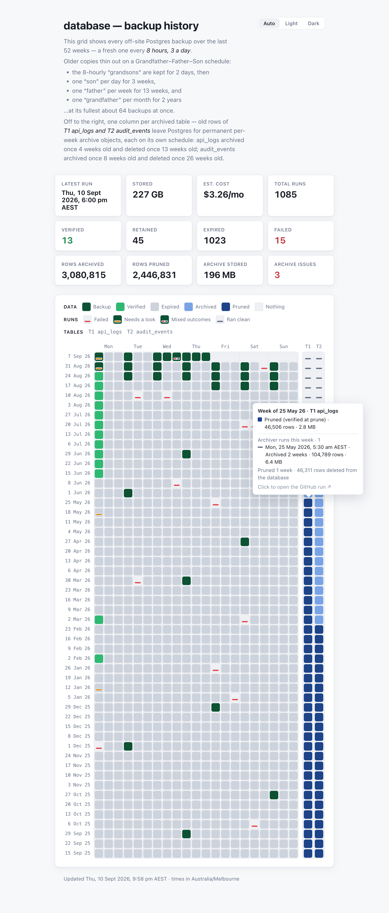

# the-gitfather

> Off-site, **G**randfather-**F**ather-**S**on retained, monitored, restore-verified Postgres backups —
> driven by GitHub Actions, stored on Cloudflare R2.

<p align="center">
  
</p>

<p align="center"><sub>The static <a href="docs/dashboard.md">backup-history dashboard</a> — every 8-hourly backup over a 1-year window, with restore-verified drills, row-retirement columns, storage and estimated R2 cost. The tooltip splits what a week <em>holds</em> from what ran <em>during</em> it.</sub></p>

A small, **profile-driven** tool any project can adopt: point it at a Postgres connection string and an
R2 bucket and you get the **off-site, immutable, restore-verified** pillars of the 3-2-1-1-0 backup
pattern, with a daily Slack status row and a static backup-history dashboard. The engine knows nothing
about any one project; everything project-specific lives in a `profiles/*.yaml` file kept in *your*
repo, and credentials come from the environment (GitHub secrets), never from the repo.

---

## What you get

- **8-hourly dumps, promoted to GFS tiers** — one dump per run, server-side copied into
  daily/weekly/monthly; retention and 14-day WORM immutability enforced by R2 lifecycle rules and
  bucket locks, not by code. → [R2 buckets, retention, locks and tokens](docs/r2-setup.md)
- **Backup-time integrity** — a size floor, a `pg_restore -l` structural check, and a SHA-256 of the
  exact uploaded bytes, before a run is called good. → [Verifying backups](docs/verify-and-restore.md)
- **Daily durable verification** — every durable object is hash-checked on write and full-restored
  (the freshest daily each day, weekly/monthly again at ~2 weeks), with row-count gates and a census
  floor that pages for anything the log names but the listing didn't return.
  → [Verifying backups](docs/verify-and-restore.md)
- **Staleness watchdog with self-heal** — a 10-minute check that re-triggers a missed backup slot and
  pages when it can't. → [Configuration & `doctor`](docs/configuration-and-troubleshooting.md)
- **Alerting that survives GitHub being the broken thing** — one Slack message per day updated in
  place, a failure-only webhook, and an external dead-man's-switch.
  → [Slack and alerting](docs/slack-and-alerting.md)
- **A static backup-history dashboard** — a single self-contained page built from an append-only
  run-log in R2. No server, no database. → [Backup-history dashboard](docs/dashboard.md)
- **A table archiver** — move aged rows of an append-only table out of Postgres into one encrypted
  object per ISO week, then delete them only after a hash- and fingerprint-gated re-check. Optional,
  and it gets its own dashboard columns. → [Archiving a table out of Postgres](docs/archiving.md)
- **Client-side encryption** — `encryption: age`, with a *separate* recipient for archives whose
  identity never enters CI. → [Archiving](docs/archiving.md#encryption-a-different-recipient-from-the-dumps)
- **A read-only preflight** — `npm run doctor -- all` runs the real config schema plus live probes of
  every external client, and writes nothing.
  → [Configuration & `doctor`](docs/configuration-and-troubleshooting.md#config-validation--doctor)
- **Guarded R2 token rotation** — `npm run roll-r2` mates, connects, escrows and publishes a rolled
  credential in that order, and tracks when one is overdue.
  → [Rotating an R2 token](docs/r2-setup.md#rotating-an-r2-token--npm-run-roll-r2)
- **An optional Cloudflare scheduler** — one Worker firing every client's workflows on time, instead
  of GitHub's best-effort cron. → [`scheduler/`](scheduler/README.md)

---

## How it fits together

The reusable workflows live here; **each consuming repo keeps a thin caller workflow** that owns the
cron schedule + secrets and passes the path to its own profile. Because this repo is public, the
reusable workflows check out their own script code with no token. Because the profile lives in the
*caller* repo, each reusable workflow checks out two things: the caller repo (for the profile) and this
repo (for the scripts).

```
your-repo                              the-gitfather (this repo, public)
  pg-backup/myproject.yaml   ─────►     scripts/ + dashboard/
  .github/workflows/                   .github/workflows/  (reusable)
    pg-backup.yml ───────────uses────────►  pg-backup.yml
    pg-durable-verify.yml ───uses────────►  pg-durable-verify.yml   (daily; supersedes the weekly drill)
    pg-restore-drill.yml ────uses────────►  pg-restore-drill.yml    (optional once durable-verify is wired)
    pg-staleness-check.yml ──uses────────►  pg-staleness-check.yml
    pg-dashboard.yml ────────uses────────►  pg-dashboard.yml
    pg-archive.yml ──────────uses────────►  pg-archive.yml          (optional, weekly)
```

> **Scheduling — GitHub cron *or* the Cloudflare scheduler.** The caller workflows carry their own
> `schedule:` cron, which is the simplest setup; GitHub's cron is best-effort and occasionally drops
> ticks (the staleness watchdog exists to self-heal exactly that). To schedule several projects
> punctually from one free Worker instead, see [`scheduler/README.md`](scheduler/README.md).

---

## Where this fits: 3-2-1-1-0

The tool nails the back half (**1-1-0**) and supplies **one off-site copy** toward the front half — it
does not by itself give you 3 independent copies on 2 distinct media. To earn the full **3-2-1-1-0**,
add a second, independent backup leg on a different medium / failure domain (e.g. a periodic `pg_dump`
to local disk/NAS, or replicate the R2 bucket to another provider or region). The dump this tool
already produces is the natural feed for it.

Digit by digit, and the threats each part is and isn't good for:
[Where this fits: 3-2-1-1-0 and threat model](docs/threat-model.md).

---

## Quick start

> **The fastest path is to hand [`docs/setting-up-gitfather.md`](docs/setting-up-gitfather.md) to an AI
> coding agent** — a guided walkthrough that interviews you for each value, writes the profile +
> secrets, and finishes with a green `doctor` check.

By hand, in order:

1. **Create the R2 bucket, lifecycle rules and locks** (once, with account-level Cloudflare creds), and
   mint the scoped CI token. → [R2 setup](docs/r2-setup.md)
2. **Copy [`profiles/example.yaml`](profiles/example.yaml)** into your repo as `pg-backup/<name>.yaml`
   and edit it. → [Profile reference](docs/configuration-and-troubleshooting.md#profile-reference)
3. **Add the caller workflows** — backup, staleness, dashboard, durable-verify, and optionally archive.
   → [Wiring a consuming repo](docs/wiring-a-consuming-repo.md)
4. **Set the secrets and variables** in your repo; secrets must be passed **explicitly**, not with
   `secrets: inherit`. → [Secrets and variables](docs/wiring-a-consuming-repo.md#3-set-the-secrets--variables-in-your-repo)
5. **Preflight**: `npm ci && PROFILE=pg-backup/<name>.yaml npm run doctor -- all` — read-only, safe
   against production creds. → [`doctor`](docs/configuration-and-troubleshooting.md#config-validation--doctor)
6. **Fire the backup once** by `workflow_dispatch` and confirm an object lands under
   `<backup-prefix>/2hourly/`, a run appears in `_log/`, and the dashboard renders.

---

## Repository layout

```
the-gitfather/
  scripts/
    backup-pg-to-r2.ts        # dump → (encrypt) → upload 2hourly/ → promote to daily/weekly/monthly; records a SHA-256
    verify-durable-pg.ts      # DAILY: hash-check each durable object + restore freshest daily + re-restore aged weekly/monthly
    restore-drill-pg.ts       # pull newest → restore into a throwaway → assert row counts (exports drillObject)
    check-staleness.ts        # alert if no fresh backup landed recently; self-heal a missed tick
    archive-table.ts          # move aged rows out of Postgres into per-ISO-week objects; prune, gated
    backfill-archive-sizes.ts # maintenance: fill missing object sizes into the archive index
    build-dashboard.ts        # render the static backup-history dashboard from the R2 run-logs
    doctor.ts                 # read-only preflight: same config schema + live client probes
    roll-r2-token.ts          # escrow a rolled/minted R2 token: verify → 1Password → GitHub secrets
    profile-export.ts         # emit the few profile values a CI bash step needs, as KEY=value
    runlog.ts                 # append-only run/verification log in R2 (the dashboard's source of truth)
    lib/                      # shared internals: config + profile schema, R2/Postgres/Slack clients,
                              #   scheduling, tier maths, log store, preflight probes (all .ts)
    __tests__/                # unit + bash-parity tests (node:test via tsx)
  dashboard/                  # the static page: template.html + heatmap.ts (SVG renderer) + theme.ts
  scheduler/                  # optional Cloudflare Worker that schedules every client's workflows
  profiles/example.yaml       # copy this into YOUR repo and edit
  docs/                       # the documentation linked below
  .github/
    workflows/                # REUSABLE (on: workflow_call): pg-backup, pg-durable-verify,
                              #   pg-restore-drill, pg-staleness-check, pg-dashboard, pg-archive
    actions/setup-tools       # composite: pinned rclone (+ optional pg client)
```

Built as a GitHub-Actions toolkit (TypeScript run via `tsx`), but every script is runnable locally for testing.

---

## Documentation

| Document | What's in it |
|---|---|
| [Setting up the-gitfather](docs/setting-up-gitfather.md) | The LLM-guided walkthrough: an interview, the files it writes, and a green `doctor` |
| [Wiring a consuming repo](docs/wiring-a-consuming-repo.md) | Every caller workflow, and the secrets/variables table |
| [R2 buckets, retention, locks and tokens](docs/r2-setup.md) | The GFS tiers, the `wrangler` setup, and rotating the CI token |
| [Verifying backups and restoring for real](docs/verify-and-restore.md) | The three integrity checkpoints, and the DR restore recipe |
| [Archiving a table out of Postgres](docs/archiving.md) | The optional archiver: weeks, prune gating, keys, backfills |
| [Backup-history dashboard](docs/dashboard.md) | What every cell means, what is published, how it's built |
| [Slack and alerting](docs/slack-and-alerting.md) | The daily row, the failure webhook, the dead-man's-switch |
| [Configuration, `doctor`, and troubleshooting](docs/configuration-and-troubleshooting.md) | Profile reference, validation, preflight, local runs, symptoms |
| [Where this fits: 3-2-1-1-0](docs/threat-model.md) | The honest mapping, and the threat model |
| [`scheduler/README.md`](scheduler/README.md) | The optional Cloudflare Worker scheduler |
| [`profiles/example.yaml`](profiles/example.yaml) | The annotated profile — every knob, with its default |

---

## Development

```bash
npm ci
npm test          # unit + bash-parity tests (node:test via tsx)
npm run typecheck # tsc --noEmit
npm run lint      # eslint
```

`npm ci` also points `core.hooksPath` at `.githooks` (the `prepare` script), so a pre-commit hook lints
staged JS/TS and a lint error blocks the commit.

Every script runs locally against real credentials — see
[Running locally](docs/configuration-and-troubleshooting.md#running-locally-before-relying-on-ci).

---

## License

MIT — see [`LICENSE`](LICENSE).
