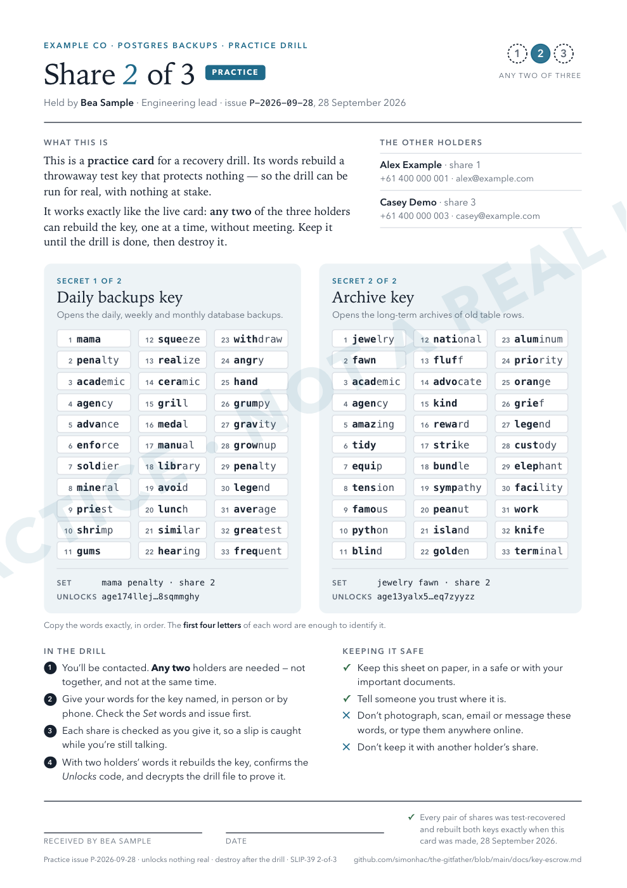

# Key escrow: 2-of-3 recovery cards

A backup nobody can decrypt is not a backup. With `encryption: age`, every dump and archive can only
be opened with its **identity** (the `AGE-SECRET-KEY-1…`). If that identity lives in exactly one
password vault, then losing the vault, or its owner, loses every encrypted backup at once.

`npm run key-shares` splits each identity into three **shares**, and any two of them rebuild it. Each
of three people (**holders**) gets one printed A4 card carrying their share of every key, plus what the
card is, who the other holders are, and what to do when it is needed. No single holder can open
anything, and losing any one card loses nothing.

<p align="center"></p>

## How it works

- **The standard is [SLIP-39](https://github.com/satoshilabs/slips/blob/master/slip-0039.md)**
  (Shamir's secret sharing, written as words, from SatoshiLabs/Trezor). A share is **33 words** from a
  fixed list of 1,024. The splitting and combining are done by the reference implementation,
  [`shamir-mnemonic`](https://github.com/trezor/python-shamir-mnemonic). None of that code lives in
  this repo, and it can rebuild a key without this repo.
- **What gets split is the identity's 32 raw bytes, not its text.** The rebuilt bytes re-encode to
  exactly the original `AGE-SECRET-KEY-1…`.
- **Each key gets its own set of shares.** A card for the dump identity and the archive identity has
  two panels. Each key can be recovered on its own.
- **There is no SLIP-39 passphrase.** A passphrase would be one more secret that needs escrow.
- **Holders never need to be together.** One share on its own reveals nothing about the key. So the
  person running a recovery can take one holder's words on Monday, keep them, and take a second
  holder's words on Thursday.

### What catches a mistake

| Mistake | Caught by | When |
|---|---|---|
| A misspelt word (`radz`) | The word list. Any 4 letters that don't start a list word are rejected. | As the line is typed |
| A wrong but real word, or two words swapped | The share's own checksum (its last 3 words). Up to 3 wrong words are always caught; beyond that, the chance a mistake slips through is under 1 in a billion. | When the 33rd word is in, while the holder is still on the phone |
| Words from the other key, or from an older issue of the cards | The set identifier (the first two words, printed as **Set**) | Before combining |
| The same holder's words entered twice | The share number | Before combining |
| Anything that still gets through | A 32-bit check of the rebuilt key built into SLIP-39, and then `recover` refuses unless the key derives the **Unlocks** code printed on the card | After combining |

The first four letters of every SLIP-39 word are unique. That's why they're bold on the card, and why
typing four letters per word is enough.

## Setup

You need `age` (with `age-keygen`), Chrome or Chromium to print the cards (`CHROME=` if it isn't found),
and the reference library in its own virtualenv:

```bash
python3 -m venv ~/.slip39 && ~/.slip39/bin/pip install shamir-mnemonic
export SLIP39_PYTHON=~/.slip39/bin/python
```

Then write a **ceremony file**. [`profiles/ceremony.example.yaml`](../profiles/ceremony.example.yaml)
has every field. It names the three holders (holder N gets share N), and for each key it gives a title,
the env var the identity will be read from, and the public recipient the identity must derive. The
file holds no secrets but it names people, so keep it in the consuming repo or somewhere private, not
here.

## The live ceremony

The cards are only as safe as the machine that prints them. Use a machine you trust, and a printer
attached directly to it, not a cloud or office print queue that keeps a copy of each job.

```bash
AGE_IDENTITY="$(op read 'op://<vault>/<item>/AGE_IDENTITY')" \
AGE_ARCHIVE_IDENTITY="$(op read 'op://<vault>/<item>/AGE_ARCHIVE_IDENTITY')" \
  npm run key-shares -- cards --ceremony path/to/ceremony.yaml --out ~/key-cards
```

`cards` checks everything before it prints anything:

1. It refuses unless each identity derives the recipient the ceremony file pins. This stops you from
   escrowing the wrong key by mistake.
2. It splits each key 2-of-3 and rebuilds it from **every** pair (1+2, 1+3, 2+3). It refuses unless
   each pair gives back the identity byte for byte.
3. It prints three PDFs, one per holder, and refuses any card that runs onto a second page. A card that
   lost its bottom lines would be worse than no card. If anything fails partway through, the cards
   already written are deleted, so there is never a partial issue to hand out.

The HTML the cards are printed from is written to a private temp dir and deleted. **The PDFs are
secret.** They are covered by `.gitignore`, but still: print each one, then delete the PDFs.

**Getting cards to holders who aren't in the same room.** Put each card in a sealed envelope and get it
to its holder by hand, courier or registered post. Never by email or message. Ask each holder to sign
and date the card, and to tell you it arrived. If you want to confirm a card is legible, the holder can
read it back by phone into `npm run key-shares -- check-share`. This reveals nothing new, because you
printed it.

Record who holds which share of which issue in the private place the ceremony file lives. Cards show
their **issue**: set `issue:` in the ceremony file and increase it for every live re-issue. The footer
of each live card says it replaces every earlier live card, and tells holders to destroy the old ones.

## Practice drills

A recovery procedure that has never been run doesn't really exist. You can run a drill whenever you
like, without touching the real keys:

```bash
npm run key-shares -- practice --ceremony path/to/ceremony.yaml [--issue P-2026-10] [--out ~/drill]
```

This gives the same holders the same card layout, but with **throwaway keys**. The practice cards
differ from live ones in three ways:

- They are blue, not rust.
- They carry a PRACTICE label and a watermark.
- They have their own issue (`P-<date>` by default).

Next to the cards, `practice` writes one `drill-<key>-issue-<issue>.txt.age` file per key, encrypted to
that practice key. The drill has succeeded when it opens that file. The drill files are not secret.

Hand out the practice cards like live ones, then run a recovery exactly as below. At the end, holders
destroy their practice cards. `npm run key-shares -- demo` does the same with made-up sample holders,
which is useful for showing someone what a card looks like.

## Recovering a key

Recover **one key at a time**. You need any two holders. They don't need to be together or available
at the same time.

```bash
# Monday: the first holder reads their words out (in person or by phone) for the key you name.
# The share is checked as it is typed; a slip is flagged while they're still there.
npm run key-shares -- check-share > share-from-holder-1.txt

# Thursday: the second holder. Give the Unlocks code from either card, abbreviated as printed.
npm run key-shares -- recover --recipient 'age1wua245…aq0was0u' \
  --share share-from-holder-1.txt > identity.txt
```

If both holders are available at the same session, skip `check-share` and run `recover` on its own. It
prompts for both shares.

Before saying their words, holders should check that the **Set** words and the issue on their card
match the ones you expect. That catches the wrong panel or an old card before anyone reads 33 words
out.

- **The saved share file** reveals nothing about the key on its own. Delete it when the recovery is
  done, and don't keep it anywhere that also holds another share.
- **The identity** is printed only if it derives the recipient you gave. Prove it works on a real
  object with the [manual drill](verify-and-restore.md#verifying-backups-integrity):
  `AGE_IDENTITY=identity.txt npm run drill-object -- --key <tier>/<file>.dump.age`. For a practice
  drill, decrypt its file instead: `age -d -i identity.txt drill-….txt.age`.

### Without this repo

The cards say "SLIP-39" so that anyone can do a recovery even if this repo is gone. You need the
reference CLI and a four-line bech32 conversion. The [recovery kit](#the-recovery-kit) carries both, and
its README walks the same path with no network at all; with the internet still there:

```bash
python3 -m venv slip39 && slip39/bin/pip install 'shamir-mnemonic[cli]' bech32
slip39/bin/shamir recover          # type each holder's 33 words; prints the master secret in hex
slip39/bin/python -c "import bech32,sys; print(bech32.bech32_encode('age-secret-key-', \
  bech32.convertbits(bytes.fromhex(sys.argv[1]), 8, 5)).upper())" <hex> > identity.txt
age-keygen -y identity.txt         # must print the recipient the card's Unlocks code abbreviates
```

## The recovery kit

The cards are only half of a recovery. Years from now, whoever holds them also needs the code that
reads them, age, zstd and `pg_restore`, and none of that can be assumed to be one download away. The
**recovery kit** is all of it, pinned and checksummed, stored in the backup bucket beside the backups:

| | |
|---|---|
| **SLIP-39** | The spec and its 1,024-word list: with these alone, a key can be rebuilt by hand |
| **Python** | `shamir-mnemonic` (the version CI tests), `bech32` and `click`, as wheels that install offline |
| **age** | Binaries for macOS (arm64, amd64), Linux (amd64, arm64) and Windows, the source, and the spec |
| **zstd** | The source, the Windows binary, and RFC 8878. Table archives are zstd-compressed before encryption. |
| **PostgreSQL** | The source for the dump major, with zlib (dumps are gzip-compressed), bison, flex and m4 (building it needs them) |
| **Docs** | A "start here" README for a stranger, `build-tools.sh`, this runbook, and the manifest |

It holds what *recovery* needs, not what runs the backups. The npm tooling, rclone (R2 speaks plain S3)
and this repo are deliberately left out.

[`recovery-kit/manifest.yaml`](../recovery-kit/manifest.yaml) pins each artifact by URL, version and
SHA-256, and says where each checksum came from. The comment at its top says how to bump one.

```bash
npm run recovery-kit -- build [--out <dir>]      # fetch, refuse any byte that differs, assemble; also <dir>.tar
npm run key-shares -- drill --kit <dir>          # prove it complete, offline (below)
R2_ACCOUNT_ID=… R2_BUCKET=… R2_ACCESS_KEY_ID=… R2_SECRET_ACCESS_KEY=… \
  npm run recovery-kit -- upload --kit <dir>     # store it under recovery-kit/<date>-<digest>/, then re-verify
npm run recovery-kit -- verify [--kit-id <id>]   # re-download every stored kit and re-hash every byte
```

- **Each kit is stored once, and never changed.** Its id is the date plus a digest of its `SHA256SUMS`.
  Uploading a kit whose digest is already stored does nothing. `SHA256SUMS` goes up last, so a kit
  without one is an upload that was cut short; `verify` calls it incomplete and `upload` resumes it.
- **The prefix is locked with no expiry.** Set that up once, by hand, with account-level credentials:
  [R2 setup](r2-setup.md#the-recovery-kit-prefix). The CI token (read and write, no delete) is enough to
  upload and verify.
- **Rebuild and upload after bumping the manifest**, or after editing this runbook: the kit carries a
  copy. `verify` marks a stored kit that is older than the manifest.
- **A second copy on a USB drive**, held by one of the key holders, covers losing R2 itself. `build`
  writes the kit as one plain `.tar` too, for that. A holder who keeps the drive with their card is still
  only one share: the kit holds no secret.

### Proving the kit offline

A kit nobody has recovered from is a kit on faith. The offline drill runs a whole recovery in a
container with **no network**, holding only the kit and a practice issue:

```bash
npm run key-shares -- drill --kit <dir>   # Docker, OrbStack or Podman (DOCKER=<binary>); about 5 minutes
```

It makes two throwaway keys, splits each 2-of-3, and hands the container holders 1 and 3's shares, the
public recipient each key must derive, and an archive file made the way the archiver makes them (rows,
then zstd, then age). Inside a stock `python:3.12-bookworm` image started with `--network none`,
[`recovery-kit/offline-drill.sh`](../recovery-kit/offline-drill.sh) follows the kit's README:

1. It checks it really is offline, then checks the kit against `SHA256SUMS`.
2. It installs the Python wheels with `pip --no-index`, and checks the library's word list is the spec's.
3. It rebuilds both keys with `shamir recover` and the bech32 one-liner.
4. It runs the kit's `build-tools.sh`, which builds age, zstd, m4, bison, flex, zlib and PostgreSQL.
5. It checks each rebuilt key derives its recipient, and opens the archive file.
6. It dumps a small database with the kit's own `pg_dump -Fc` (the host's may be a newer major) and
   encrypts it to the practice recipient. Then it decrypts that with the rebuilt key, restores it, and
   checks the row.

If the kit lacks anything a recovery needs, a step fails. That is how bison, flex and m4 got into it:
PostgreSQL 17's source no longer includes its generated parser, and the first drill failed on it. Run
the drill after every change to the manifest, before uploading.

### The monthly drill runs on the kit

The [manual drill](verify-and-restore.md#verifying-backups-integrity) (`npm run drill-object`) does not
use the laptop's own age and `pg_restore`. It downloads the newest complete kit from the bucket (or
`--kit-id <id>`) and checks every byte, then builds the kit's tools and runs the drill on them. The kit's
id goes into the verification record. The first drill on a new kit takes a few extra minutes; the tools
are cached per kit id after that, in `~/.cache/the-gitfather/kit-tools/` (or `$GITFATHER_KIT_CACHE`).
With `verify-durable.drill-max-age-days` set, only drills that ran on the kit count as recent.

## When holders change, or a card is lost

- **A holder leaves, or a card is lost or destroyed:** run a new live issue with a new third holder and
  an increased `issue`, and ask the remaining holders to destroy their old cards. Shares from different
  issues never combine, because their set identifiers differ.
- **A card may have been copied, or a holder can't be trusted:** re-issuing is **not enough**. Two old
  shares still rebuild the old key, and that key still opens every object encrypted to it. Rotate the
  age key itself: generate a new identity, switch the recipients to it, and escrow the new key. Objects
  encrypted to the old key stay readable with it until they age out of retention.
- **Once a year:** ask each holder to confirm they still have their card and know where it is, and run
  a practice drill. Run `npm run recovery-kit -- verify` too.
